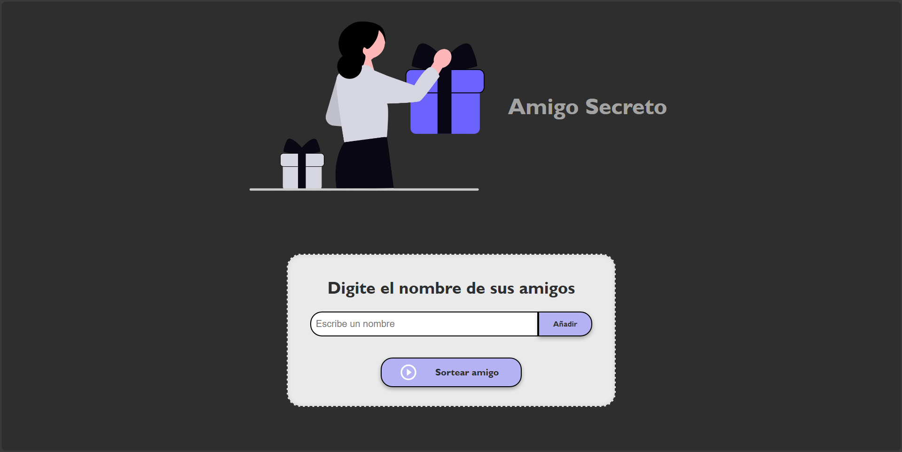
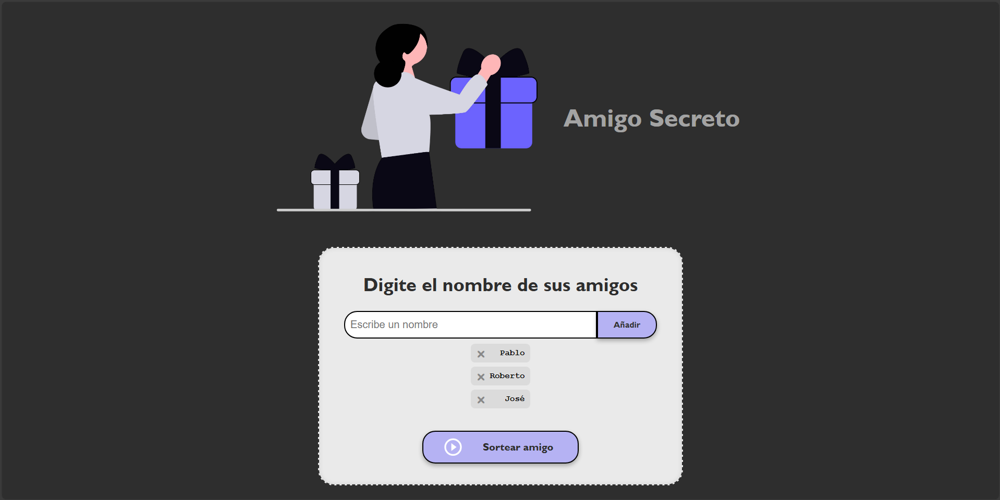
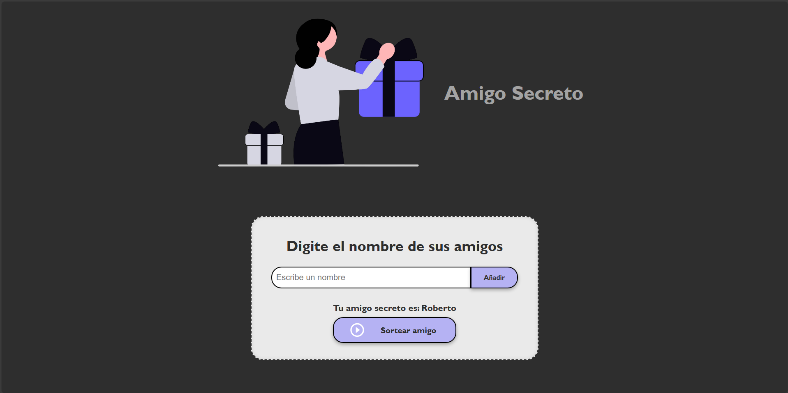

# 🎁 Challenge: Amigo Secreto - Alura Latam

Este proyecto se desarrolló como parte del primer Challenge del programa de formación ONE.

## Descripción

La aplicación permite:

- Registrar participantes
- Permite eliminar amigos de la lista antes de sortearlos
- Realizar el sorteo del amigo secreto de manera aleatoria
- Muestra el resultado de quién es el amigo secreto

## Tecnologías utilizadas

- HTML
- CSS
- JavaScript

## Screenshots

